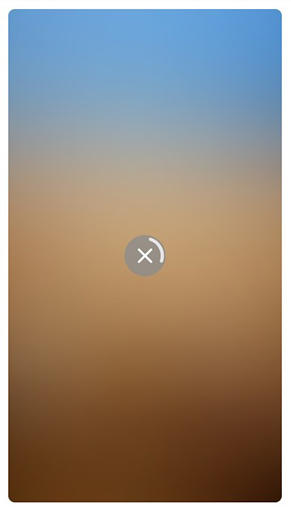

Pictish
=======

An Android component to display image preloading, with the possibility of manual downloading, automatic cache processing and transformation with a Blur effect.

[](https://jitpack.io/#jdsdhp/pictish) 
[](https://android-arsenal.com/api?level=17) 
[](https://github.com/jdsdhp/pictish/blob/master/LICENSE) 
[](https://twitter.com/jdsdhp)

## Screenshots
Idle State | Loading State | Loaded State
:-:|:-:|:-:
 |  | 

## Including in your project

#### Gradle

```gradle
allprojects  {
    repositories {
        ...
        maven { url 'https://jitpack.io' }
    }
}
dependencies {
    implementation 'com.github.jdsdhp:pictish:$version'
}
```

## Usage

### Kotlin
  Simple Usage from Activity or Fragment.  Images in this example have been loaded from [Lorem Picsum](https://picsum.photos).
```kotlin
val id = 100

val imageDownloadView: ImageViewDownloader = findViewById(R.id.image_view_downloader)
imageDownloadView.preLoad(
     thumbUrl = "https://picsum.photos/id/$id/50",
     fullUrl = "https://picsum.photos/id/$id/1000"
)
```
### XML
Adding the component in layout file.
```xml
<com.jesusd0897.pictish.ImageViewDownloader
     android:id="@+id/image_view_downloader"
     android:layout_width="match_parent"
     android:layout_height="match_parent"
     app:ivd_image_border_radius="16dp" />
```

### Styling
For styling colors and shapes.
```xml
<style name="AppTheme" parent="Theme.MaterialComponents.Light.NoActionBar">
     <!-- Your app style here...... -->
         
     <item name="colorPictishProgress">#00695C</item>
     <item name="colorPictishIconStatus">#FFFFFF</item>
     <item name="colorPictishDefaultPlaceholder">#B3B3B3</item>
     <item name="colorPictishControlNormal">#FFFFFF</item>
     <item name="colorPictishControlSoft">#80FFFFFF</item> 
</style>
```

## Sample project

It's very important to check out the sample app. Most techniques that you would want to implement are already implemented in the examples.

View the sample app's source code [here](https://github.com/jdsdhp/pictish/tree/master/app)

License
=======

    Copyright (c) 2020 jesusd0897.
    
    Licensed under the Apache License, Version 2.0 (the "License");
    you may not use this file except in compliance with the License.
    You may obtain a copy of the License at
    
        http://www.apache.org/licenses/LICENSE-2.0
    
    Unless required by applicable law or agreed to in writing, software
    distributed under the License is distributed on an "AS IS" BASIS,
    WITHOUT WARRANTIES OR CONDITIONS OF ANY KIND, either express or implied.
    See the License for the specific language governing permissions and
    limitations under the License.