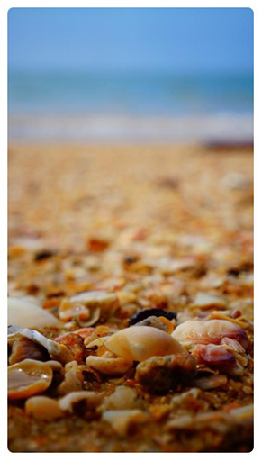

🎨 Pictish
=======
An Android component to display image preloading, with the possibility of manual downloading, automatic cache processing and transformation with a Blur effect.
This library is based on [Picasso](https://github.com/square/picasso) and [AndroidButtonProgress](https://github.com/abdularis/AndroidButtonProgress).

[](https://jitpack.io/#jdsdhp/pictish) 
[](https://android-arsenal.com/api?level=17) 
[](https://opensource.org/licenses/Apache-2.0)
[](https://twitter.com/jdsdhp)

## Screenshots
Idle State | Cancel State | Finish State
:-:|:-:|:-:
 |  | 

## Including in your project

#### Gradle

```gradle
allprojects  {
    repositories {
        ...
        maven { url 'https://jitpack.io' }
    }
}
dependencies {
    implementation 'com.github.jdsdhp:pictish:$version'
}
```

## Usage

### Kotlin
Usage from Activity or Fragment using `Pictish.Builder`.  Images in this example have been loaded from [Lorem Picsum](https://picsum.photos).<br>
The first thing you need is the `parentView`, a `ViewGroup` where to insert the component, it can be a `FrameLayout`, `LinearLayout` and others.
```kotlin
val id = 100

val pictish = Pictish.Builder(context, parentView)
    .setThumbUrl("https://picsum.photos/id/$id/50")
    .setFullUrl("https://picsum.photos/id/$id/900")
    .build() //Build Pictish object
    .preLoad() //Init component preload.
```

### Behavior customizations.
Instead `preLoad()` method you can use `load()` to load image directly.
For custom behavior you can add some code to `Pictish.Builder` enabling a custom Picasso instance, cancelable functionality and cache usage.
```kotlin
.setPicasso(Picasso.Builder(this).downloader(OkHttp3Downloader(provideTrustingOkHttp())).build())
.isCancelable(true)
.useCache(true)
```

### Styling
For styling colors, dimensions and icons you can add this to `Pictish.Builder` with your own parameters.
```kotlin
.setButtonWith(100)
.setButtonHeight(100)
.setIconWith(64)
.setIconHeight(64)
.setImageBorderRadius(16f)
.setProgressIndeterminateSweepAngle(90)
.setProgressMargin(4)
.setBlurRadius(10)
.setEmptyPlaceholder(ContextCompat.getDrawable(context, R.drawable.ic_default_placeholder))
.setButtonIdleIcon(ContextCompat.getDrawable(context, R.drawable.ic_default_idle_icon))
.setButtonCancelIcon(ContextCompat.getDrawable(context, R.drawable.ic_default_cancel_icon))
.setButtonFinishIcon(ContextCompat.getDrawable(context, R.drawable.ic_default_finish_icon))
.setIdleBgColor(ContextCompat.getColor(context, R.color.color_default_idle_background))
.setErrorBgColor(ContextCompat.getColor(context, R.color.color_default_error_background))
.setFinishBgColor(ContextCompat.getColor(context, R.color.color_default_finish_background))
.setIndeterminateBgColor(ContextCompat.getColor(context, R.color.color_default_indeterminate_background))
.setDeterminateBgColor(ContextCompat.getColor(context, R.color.color_default_determinate_background))
.setProgressDeterminateColor(ContextCompat.getColor(context, R.color.color_default_determinate_progress))
.setProgressIndeterminateColor(ContextCompat.getColor(context, R.color.color_default_indeterminate_progress))
```

### Listeners
Adding different listeners to `Pictish`.

**OnPictishLoadListener**
```kotlin
pictish.onPictishLoadListener = object : OnPictishLoadListener {
    override fun onThumbLoadSuccess(url: String) {
        //Handle load state
    }

    override fun onThumbLoadError(url: String, e: Exception?) {
        //Handle load state
    }

    override fun onFullLoadSuccess(url: String) {
        //Handle load state
    }

    override fun onFullLoadError(url: String?, e: Exception?) {
        //Handle load state
    }
}
```
**OnPictishClickListener**
```kotlin
pictish.onPictishClickListener = object : OnPictishClickListener {
    override fun onClick(fullUrl: String?, thumbUrl: String?) {
        //Handle click
    }

    override fun onLongClick(fullUrl: String?, thumbUrl: String?) {
        //Handle click
    }
}
```
**OnPictishButtonClickListener**
```kotlin
pictish.onPictishButtonClickListener = object : OnPictishButtonClickListener {
    override fun onIdleButtonClick(fullUrl: String?, thumbUrl: String?) {
        //Handle click
    }

    override fun onCancelButtonClick(fullUrl: String?, thumbUrl: String?) {
        //Handle click
    }

    override fun onFinishButtonClick(fullUrl: String?, thumbUrl: String?) {
        //Handle click
    }
}
```

## Sample project
It's very important to check out the sample app. Most techniques that you would want to implement are already implemented in the examples.

View the sample app's source code [here](https://github.com/jdsdhp/pictish/tree/master/app)

## Future
- Progress management.

License
=======

    Copyright (c) 2020 jesusd0897.
    
    Licensed under the Apache License, Version 2.0 (the "License");
    you may not use this file except in compliance with the License.
    You may obtain a copy of the License at
    
        http://www.apache.org/licenses/LICENSE-2.0
    
    Unless required by applicable law or agreed to in writing, software
    distributed under the License is distributed on an "AS IS" BASIS,
    WITHOUT WARRANTIES OR CONDITIONS OF ANY KIND, either express or implied.
    See the License for the specific language governing permissions and
    limitations under the License.